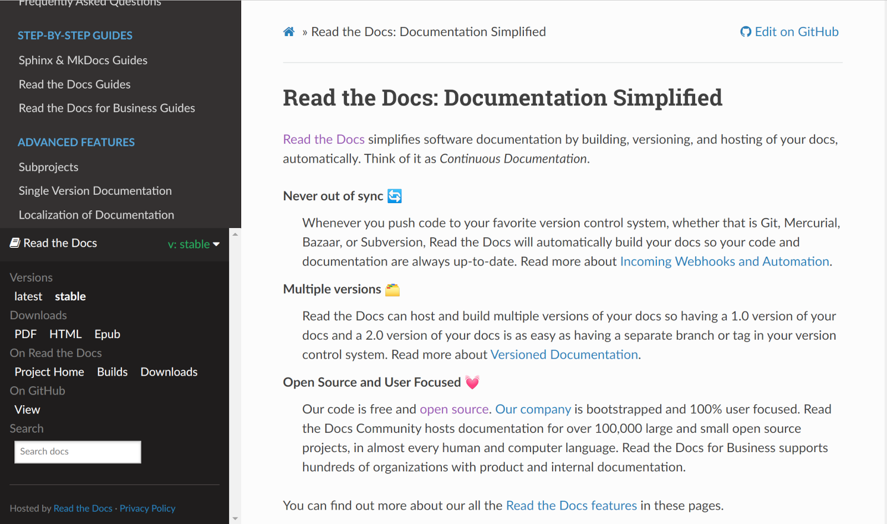
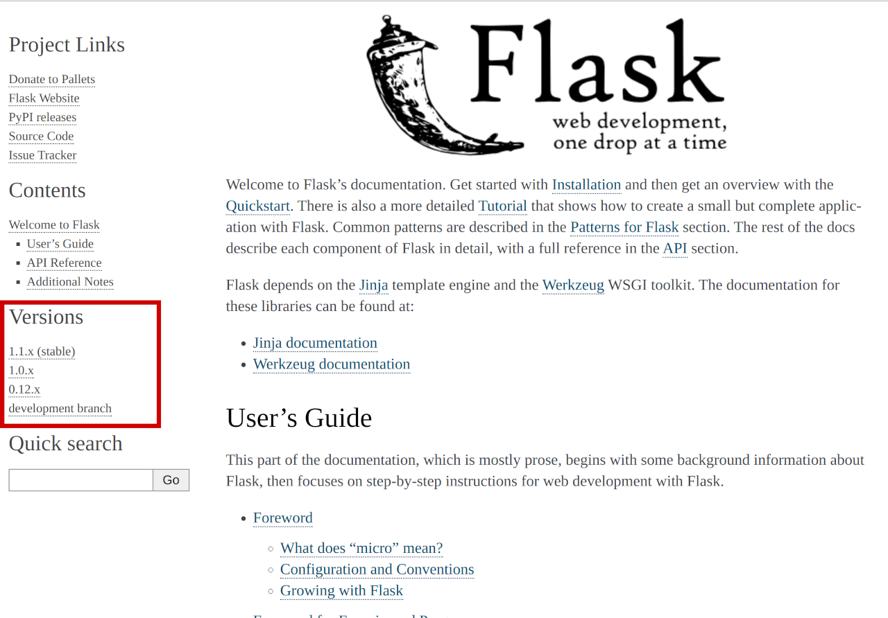

===============================
Flyout Redesign Design Document
===============================

.. warning::

    This document detailed an initial idea that was not implemented in the end.
    Lot of things have changed since this document was written.
    A different approach is being implemented as part of the work done on the new addons client at
    https://github.com/readthedocs/readthedocs-client

This document describes the design of a new "flyout API"
to replace our existing `footer_html` endpoint in APIv2.
The Read the Docs theme uses this API to put an updated version selector
with active versions into the lower left menu.
On other themes, this appears as a floating menu in the lower right.

.. contents:: Contents
   :local:
   :backlinks: none
   :depth: 1

Issues with the existing API
------------------------------

    Read the Docs with an expanded flyout menu in the lower left corner

* The largest problem with the existing ``/api/v2/footer_html`` endpoint
  is that it returns a blob of HTML.
  This limits the ability to use this data in ways other than to generate our exact flyout.
  For example, Sphinx themes other than our own cannot consume this data easily
  and there's no real integration point for MkDocs at all.
* Due to how the URLs in the version selector are generated,
  this API endpoint can be fairly expensive in the worst case for projects with many versions.
  As it stands now, this API accounts for approximately 15% of the time taken on our webservers
  at about 70ms for an average request (P95 ~= 150ms, P99 ~= 235ms).
* The current API is a combination of data about a project that contains information
  on the live versions, translations, sub- and super-projects, and links to various other things
  like downloads, the repository on the VCS, and builds for the project on RTD itself.
  Some of this data never changes (links to the project and builds on RTD itself)
  and are effectively static while some of it could change after the documentation is built (translations, active versions).

Overlap with existing API endpoints
-----------------------------------

There is already significant overlap between the APIv2 ``footer_html`` call
with the existing APIv3 for a project (eg. ``https://app.readthedocs.org/api/v3/projects/docs/``).
The project API already returns much of the data we want,
but some things like other active versions, translations, and downloads would require additional API calls or options.
These options already partially implemented via the `DRF Flex Fields <https://pypi.org/project/drf-flex-fields/>`_ module
(eg. ``https://app.readthedocs.org/api/v3/projects/docs/?expand=active_versions``).
Currently, there are separate API endpoints for translations and downloads,
but ideally all the data needed to generate a version selector would be available from a single API.

While this is a good approach, it will not be without issues.
It's likely that some database queries and especially URL generation will need to be optimized
for this to not perform worse than the existing footer API.

JavaScript integration
----------------------

Our current footer API is requested from our embedded document JavaScript (``readthedocs-doc-embed.js``)
which is placed on pages during the build process.
Currently, this is a static file that offers no integration points for theme maintainers
or project authors.
There is also some static data about the project injected into the HTML of the generated documentation (``READTHEDOCS_DATA``)
which has some basic data about the project and the specific build being served.
This includes data such as the project and version slugs, the build date, and theme.

One of the goals of this project is to give theme authors and project maintainers integration points
where they can control some aspects of Read the Docs in a repeatable, deterministic way.
In order to do this, we need to have JavaScript constants and functions that these maintainers can set.
This proposal suggests creating a new ``readthedocs`` global variable like so:

.. code-block:: javascript

    // This first line helps handle the case where the project/theme's overrides
    // are executed before the readthedocs global is defined.
    window.readthedocs = window.readthedocs || {};
    window.readthedocs.data = JSON.parse(document.getElementById('READTHEDOCS_DATA').innerHTML);

    if (!window.readthedocs.integration_version_selector) {
        // Set the default flyout menu code
        // But only if the user hasn't overridden it already
        window.readthedocs.integration_version_selector = function (project) {
            // Existing code we use to create the flyout menu
            // Currently, this is in `core/static-src/core/js/doc-embed/footer.js:injectFooter`
            // The `project` variable is the result of the v3 project API for the current project
        };
    }

When Read the Docs goes to create the flyout menu,
it will call this new ``readthedocs.integration_version_selector`` method
which will either be our default flyout menu method or the overridden method from the theme or project.

This gives us a baseline of how to add these kinds of integrations.
There are other possible integrations that users may want in the future such as:

* Control how RTD's search overrides Sphinx's built-in search.
  This could be used to remove RTD's search overrides entirely
  or to just change how they take effect.
* Control how RTD's built-in project analytics sends data.
* There could be an override to how the project's data is retrieved from the API.
  This could allow not even getting project/version/translation data at all to save an API call for the project.

Disabling the flyout entirely
~~~~~~~~~~~~~~~~~~~~~~~~~~~~~

One nice aspect of this integration is that for projects or themes that want to completely disable
the version selector, this could be done by having JS like this:

.. code-block:: javascript

    window.readthedocs = window.readthedocs || {};
    window.readthedocs.integration_version_selector = function () {};

An alternative would be a way for JS projects to define constants that affects how RTD works.
This could be something like:

.. code-block:: javascript

    window.readthedocs = window.readthedocs || {};
    window.readthedocs.customizations = {disable_custom_search: true, disable_version_selector: true};

    Flask documentation with a mockup of a custom version selector on the left sidebar

Implementation steps
--------------------

These are the steps that need to be taken to replace our existing footer API v2.
As much as possible, these steps have been setup so they can be done and rolled out independently
so they don't need to be completed all at once.

* Make the changes to APIv3 to allow requesting translations, sub- and super-projects, and downloads.
* Create a feature flag that will make projects use the new APIv3 instead of APIv2.
  Set that feature flag on our own projects.
* Modify our embedded document JavaScript to use a new ``readthedocs`` global variable.
  If this new feature flag is set, instead of calling the APIv2, the APIv3 will be called
  and then ``readthedocs.integration_version_selector`` will be called with the results.
* If all goes well, remove the feature flag and make APIv3 the default and deprecate APIv2.

Future changes not in this rollout
----------------------------------

* Removing the old ``READTHEDOCS_DATA`` variable is not part of this implementation.
  This global will continue to be available but removing it will cause some projects to break for sure.
* This proposal doesn't involve creating an integration point to control custom search.
  That could happen at a later date.
* This proposal doesn't rework how the version selector looks either on the RTD Sphinx theme
  or on other themes by default. Any restyling can be done independently of this.
