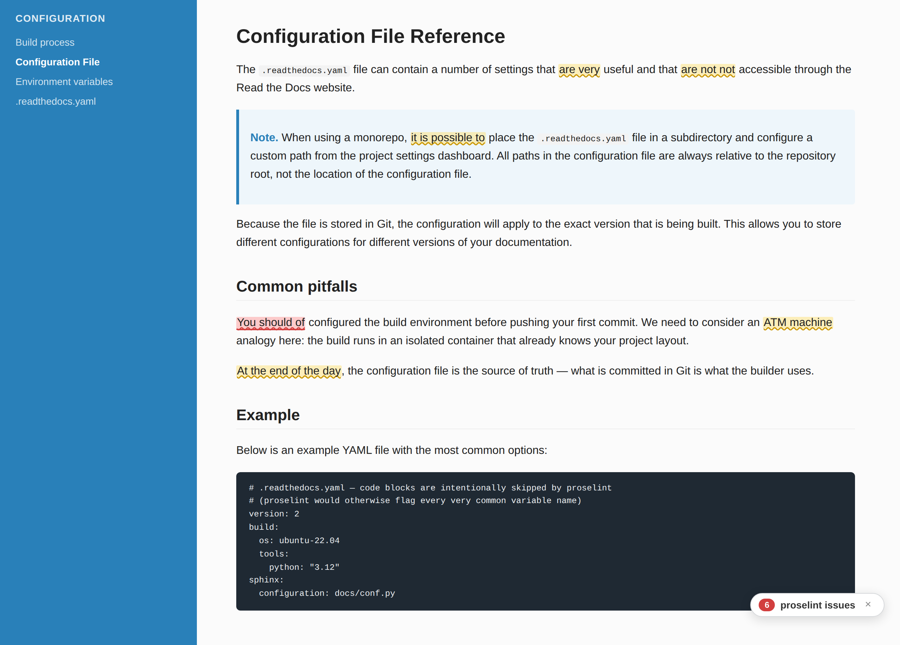
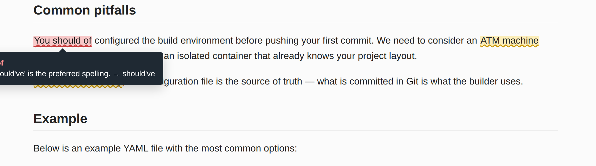

Proselint addon
===============

Goals
-----

- Run `proselint <https://github.com/amperser/proselint>`__ over the built
  HTML of every project that opts in, and store the results as a JSON
  sidecar in build media storage.
- Surface those results inline on the rendered documentation via the
  Read the Docs addons frontend, in the spirit of "Word-style red/yellow
  underlines for prose feedback".
- Keep the integration transparent for the user: they don't need to know
  proselint exists or install anything, just like the visual diff (DocDiff)
  feature.

Non-goals
---------

- Failing the build on proselint findings. Build outcome remains decoupled
  from prose lint results — this is purely informational.
- Linting raw source files (RST/Markdown). The first version lints the
  rendered HTML so that the warnings can be anchored to DOM elements
  unambiguously.

Architecture
------------

::

    build → proselint indexer (selectolax + proselint) → proselint.json in storage
              ↓
    addons API exposes addons.proselint.{enabled, url}
              ↓
    addons frontend fetches the JSON, walks the rendered DOM,
    wraps flagged spans with .proselint-warning-{warning,error}

Backend
~~~~~~~

- New ``MEDIA_TYPE_PROSELINT`` constant alongside ``MEDIA_TYPE_DIFF``.
- ``readthedocs/proselint/`` module: ``write_report`` / ``get_report``
  helpers, mirroring ``readthedocs/filetreediff/``.
- ``ProselintIndexer`` runs in the same task as the existing FTD indexer
  (``readthedocs/projects/tasks/search.py``), iterating each built HTML
  file in storage. For each block-level prose element (``p``, ``li``,
  headings, ``dd``, ``dt``, ``blockquote``) we extract text via
  ``selectolax`` (skipping ``pre``/``code``/``nav``/``script``/``style``
  subtrees), feed it to ``proselint.tools.LintFile``, and accumulate
  warnings keyed by a stable CSS selector and the matched substring.
- ``AddonsConfig.proselint_enabled`` (default ``False``) gates the
  feature per-project. ``settings.RTD_PROSELINT_ALL`` enables it
  globally for staged rollout.
- The proxito addons API (``readthedocs/proxito/views/hosting.py``)
  serializes ``addons.proselint = {"enabled", "url"}`` where ``url`` is
  the public ``build_media_storage`` URL of ``proselint.json``.

Frontend
~~~~~~~~

- New addon at ``src/proselint.js`` (``readthedocs/addons``), modelled on
  ``docdiff.js`` — a ``LitElement`` paired with an ``AddonBase`` subclass.
- Activation: ``?readthedocs-proselint=true`` on the URL turns the addon
  on. Default off, opt-in per page-load.
- DOM mutation: ``ProselintElement.applyReport`` looks up each warning's
  ``selector`` in the rendered page, finds the warning's ``snippet`` in
  the element's ``textContent`` (with whitespace-tolerant matching), and
  splits the surrounding text node so the matched range is wrapped in
  ``…``.
- Disable restores the original DOM by replacing every wrapper with its
  text content and calling ``parentNode.normalize()``.

Visual reference
----------------

   Yellow wavy underlines mark suggestions (``weasel_words.very``,
   ``redundancy.ras_syndrome``, ``cliches.misc.garner``, etc.). Red
   underlines mark errors (``spelling.ve_of`` for ``"should of"``).
   A small floating badge in the corner shows the per-page count and
   acts as a hide toggle.

   Hovering on a flagged span exposes the proselint check name and
   message. When proselint suggests a replacement, it's appended after
   ``→`` so the reader can act on it directly.

JSON report shape
-----------------

::

    {
      "version": 1,
      "files": {
        "configuration/index.html": {
          "path": "configuration/index.html",
          "warnings": [
            {
              "selector": "main > p:nth-of-type(1)",
              "snippet": "should of",
              "check": "spelling.ve_of",
              "severity": "error",
              "message": "-ve vs. -of. 'should've' is the preferred spelling.",
              "replacement": "should've"
            }
          ]
        }
      }
    }

Future work
-----------

- Lint raw source files when an authoritative source-to-DOM mapping is
  available (e.g. via a Sphinx extension that records source positions
  in HTML data attributes).
- Per-project rule configuration from the dashboard (today proselint
  uses its default check set).
