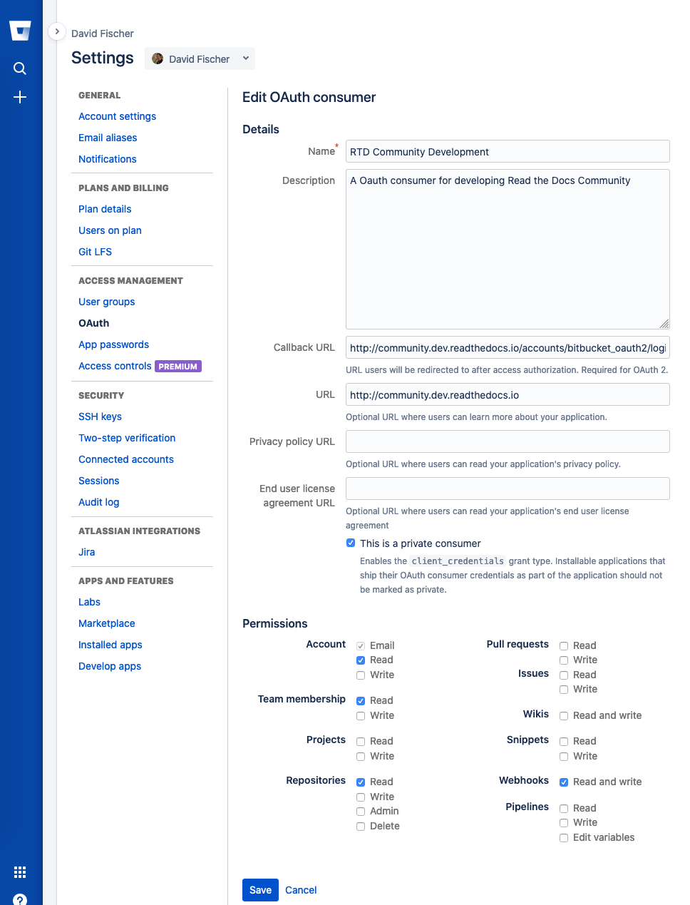

Development Installation
========================

.. meta::
   :description lang=en: Install a local development instance of Read the Docs with our step by step guide.

These are development setup and :ref:`standards <development/install:Core team standards>` that are adhered to by the core development team while
developing Read the Docs and related services. If you are a contributor to Read the Docs,
it might a be a good idea to follow these guidelines as well.

To follow these instructions you will need a Unix-like operating system,
or `Windows Subsystem for Linux (WSL) <https://docs.microsoft.com/en-us/windows/wsl/>`_.
Other operating systems are not supported.

.. note::

   We do not recommend to follow this guide to deploy an instance of Read the Docs for production usage.
   Take into account that this setup is only useful for developing purposes.

Set up your environment
-----------------------

#. install `Docker <https://www.docker.com/>`_ following `their installation guide <https://docs.docker.com/install/>`_.

#. clone the ``readthedocs.org`` repository:

   .. prompt:: bash

      git clone --recurse-submodules https://github.com/readthedocs/readthedocs.org/

#. install the requirements from ``common`` submodule:

   .. prompt:: bash

      pip install -r common/dockerfiles/requirements.txt

#. build the Docker image for the servers:

   .. warning::

      This command could take a while to finish since it will download several Docker images.

   .. prompt:: bash

      inv docker.build

   .. tip::

      If you pass ``GITHUB_TOKEN`` environment variable to this command,
      it will add support for readthedocs-ext.

#. pull down Docker images for the builders:

   .. prompt:: bash

      inv docker.pull --only-latest

#. start all the containers:

   .. prompt:: bash

      inv docker.up  --init  # --init is only needed the first time

#. add read permissions to the storage backend:

   * go to http://localhost:9000/ (MinIO S3 storage backend)
   * login as ``admin`` / ``password``
   * click "..." next to the ``static`` bucket name and then "Edit Policy"
   * leave "prefix" empty and click "Add" to give "Read Only" access on the ``static`` bucket
   * click on the "+" icon on the bottom-right corner, then "Create bucket" with the name ``media``,
     hit Enter on the keyboard, and repeat the operation above to give "Read Only" access to it

#. go to http://community.dev.readthedocs.io to access your local instance of Read the Docs.

Check that everything works
---------------------------

#. go to http://community.dev.readthedocs.io and check that the appearance and style looks correct
   (otherwise the MinIO buckets might be misconfigured, see above)

#. login as ``admin`` /  ``admin`` and verify that the project list appears

#. go to the "Read the Docs" project, click on the "Build version" button to build ``latest``,
   and wait until it finishes

#. click on the "View docs" button to browse the documentation, and verify that it works

Working with Docker Compose
---------------------------

We wrote a wrapper with ``invoke`` around ``docker-compose`` to have some shortcuts and
save some work while typing docker compose commands. This section explains these ``invoke`` commands:

``inv docker.build``
    Builds the generic Docker image used by our servers (web, celery, build and proxito).

``inv docker.up``
    Starts all the containers needed to run Read the Docs completely.

    * ``--no-search`` can be passed to disable search
    * ``--init`` is used the first time this command is ran to run initial migrations, create an admin user, etc
    * ``--no-reload`` makes all celery processes and django runserver
      to use no reload and do not watch for files changes

``inv docker.shell``
    Opens a shell in a container (web by default).

    * ``--no-running`` spins up a new container and open a shell
    * ``--container`` specifies in which container the shell is open

``inv docker.manage {command}``
    Executes a Django management command in a container.

    .. tip::

       Useful when modifying models to run ``makemigrations``.

``inv docker.down``
    Stops and removes all containers running.

    * ``--volumes`` will remove the volumes as well (database data will be lost)

``inv docker.restart {containers}``
    Restarts the containers specified (automatically restarts NGINX when needed).

``inv docker.attach {container}``
    Grab STDIN/STDOUT control of a running container.

    .. tip::

       Useful to debug with ``pdb``. Once the program has stopped in your pdb line,
       you can run ``inv docker.attach web`` and jump into a pdb session
       (it also works with ipdb and pdb++)

    .. tip::

       You can hit CTRL-p CTRL-p to detach it without stopping the running process.

``inv docker.test``
    Runs all the test suites inside the container.

    * ``--arguments`` will pass arguments to Tox command (e.g. ``--arguments "-e py36 -- -k test_api"``)

``inv docker.pull``
    Downloads and tags all the Docker images required for builders.

    * ``--only-latest`` does not pull ``stable`` and ``testing`` images.

``inv docker.buildassets``
    Build all the assets and "deploy" them to the storage.

Adding a new Python dependency
~~~~~~~~~~~~~~~~~~~~~~~~~~~~~~

The Docker image for the servers is built with the requirements defined in the current checked out branch.
In case you need to add a new Python dependency while developing,
you can use the ``common/dockerfiles/entrypoints/common.sh`` script as shortcut.

This script is run at startup on all the servers (web, celery, builder, proxito) which
allows you to test your dependency without re-building the whole image.
To do this, add the ``pip`` command required for your dependency in ``common.sh`` file:

.. code-block:: bash

   # common.sh
   pip install my-dependency==1.2.3

Once the PR that adds this dependency was merged, you can rebuild the image
so the dependency is added to the Docker image itself and it's not needed to be installed
each time the container spins up.

Debugging Celery
~~~~~~~~~~~~~~~~

In order to step into the worker process, you can't use ``pdb`` or ``ipdb``, but
you can use ``celery.contrib.rdb``:

.. code-block:: python

    from celery.contrib import rdb; rdb.set_trace()

When the breakpoint is hit, the Celery worker will pause on the breakpoint and
will alert you on STDOUT of a port to connect to. You can open a shell into the container
with ``inv docker.shell celery`` (or ``build``) and then use ``telnet`` or ``netcat``
to connect to the debug process port:

.. prompt:: bash

    nc 127.0.0.1 6900

The ``rdb`` debugger is similar to ``pdb``, there is no ``ipdb`` for remote
debugging currently.

Configuring connected accounts
~~~~~~~~~~~~~~~~~~~~~~~~~~~~~~

These are optional steps to setup the :doc:`connected accounts </connected-accounts>`
(GitHub, GitLab, and BitBucket) in your development environment.
This will allow you to login to your local development instance
using your GitHub, Bitbucket, or GitLab credentials
and this makes the process of importing repositories easier.

However, because these services will not be able to connect back to your local development instance,
:doc:`webhooks </webhooks>` will not function correctly.
For some services, the webhooks will fail to be added when the repository is imported.
For others, the webhook will simply fail to connect when there are new commits to the repository.

    Configuring an OAuth consumer for local development on Bitbucket

* Configure the applications on GitHub, Bitbucket, and GitLab.
  For each of these, the callback URI is ``http://community.dev.readthedocs.io/accounts/<provider>/login/callback/``
  where ``<provider>`` is one of ``github``, ``gitlab``, or ``bitbucket_oauth2``.
  When setup, you will be given a "Client ID" (also called an "Application ID" or just "Key") and a "Secret".
* Take the "Client ID" and "Secret" for each service and enter it in your local Django admin at:
  ``http://community.dev.readthedocs.io/admin/socialaccount/socialapp/``.
  Make sure to apply it to the "Site".

Core team standards
-------------------

Core team members expect to have a development environment that closely
approximates our production environment, in order to spot bugs and logical
inconsistencies before they make their way to production.

This solution gives us many features that allows us to have an
environment closer to production:

Celery runs as a separate process
    Avoids masking bugs that could be introduced by Celery tasks in a race conditions.

Celery runs multiple processes
    We run celery with multiple worker processes to discover race conditions
    between tasks.

Docker for builds
    Docker is used for a build backend instead of the local host build backend.
    There are a number of differences between the two execution methods in how
    processes are executed, what is installed, and what can potentially leak
    through and mask bugs -- for example, local SSH agent allowing code check
    not normally possible.

Serve documentation under a subdomain
    There are a number of resolution bugs and cross-domain behavior that can
    only be caught by using `USE_SUBDOMAIN` setting.

PostgreSQL as a database
    It is recommended that Postgres be used as the default database whenever
    possible, as SQLite has issues with our Django version and we use Postgres
    in production.  Differences between Postgres and SQLite should be masked for
    the most part however, as Django does abstract database procedures, and we
    don't do any Postgres-specific operations yet.

Celery is isolated from database
    Celery workers on our build servers do not have database access and need
    to be written to use API access instead.

Use NGINX as web server
    All the site is served via NGINX with the ability to change some configuration locally.

MinIO as Django storage backend
    All static and media files are served using Minio --an emulator of S3,
    which is the one used in production.

Serve documentation via El Proxito
    Documentation is proxied by NGINX to El Proxito and proxied back to NGINX to be served finally.
    El Proxito is a small application put in front of the documentation to serve files
    from the Django Storage Backend.

Search enabled by default
    Elasticsearch is properly configured and enabled by default.
    All the documentation indexes are updated after a build is finished.
