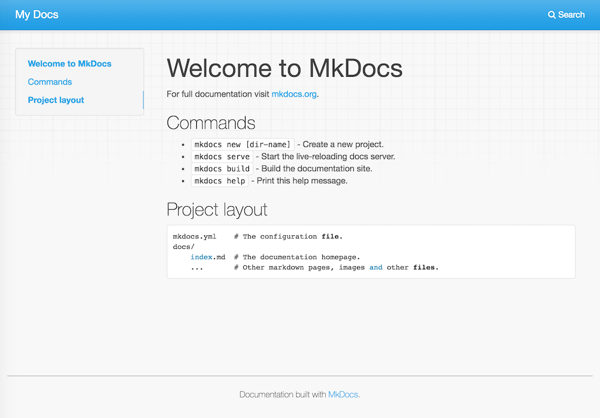

Getting Started with MkDocs
===========================

MkDocs is a documentation generator that focuses on speed and simplicity.
It has many great features including:

* Preview your documentation as you write it
* Easy customization with themes and extensions
* Writing documentation with Markdown

.. note::

    MkDocs is a great choice for building technical documentation.
    However, Read the Docs also supports :doc:`Sphinx </intro/getting-started-with-sphinx>`,
    another tool for writing and building documentation.

Quick start
-----------

Assuming you have Python already, `install MkDocs`_:

.. sourcecode:: bash

    $ pip install mkdocs

Setup your MkDocs project:

.. sourcecode:: bash

    $ mkdocs new .

This command creates ``mkdocs.yml`` which holds your MkDocs configuration,
and ``docs/index.md`` which is the Markdown file
that is the entry point for your documentation.

You can edit this ``index.md`` file to add more details about your project
and then you can build your documentation:

.. sourcecode:: bash

    $ mkdocs serve

This command builds your Markdown files into HTML
and starts a development server to browse your documentation.
Open up http://127.0.0.1:8000/ in your web browser to see your documentation.
You can make changes to your Markdown files and your docs will automatically rebuild.

    Your MkDocs project is built

Once you have your documentation in a public repository such as GitHub, Bitbucket, or GitLab,
you can start using Read the Docs by :doc:`importing your docs </intro/import-guide>`.

.. _install MkDocs: https://www.mkdocs.org/#installation

External resources
------------------

Here are some external resources to help you learn more about MkDocs.

* `MkDocs documentation`_
* `Markdown syntax guide`_
* `Writing your docs with MkDocs`_

.. _MkDocs documentation: https://www.mkdocs.org/
.. _Markdown syntax guide: http://daringfireball.net/projects/markdown/syntax
.. _Writing your docs with MkDocs: https://www.mkdocs.org/user-guide/writing-your-docs/
