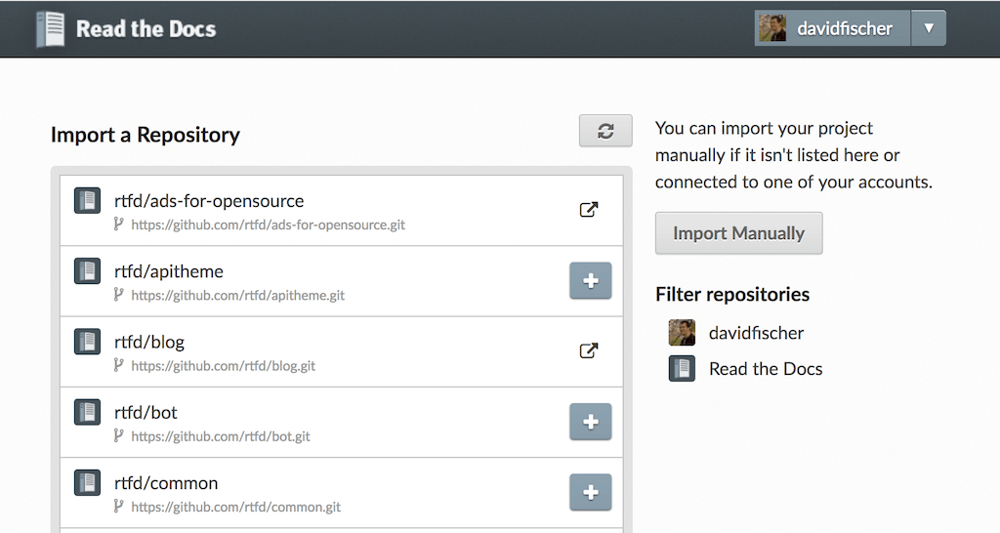

Importing Your Documentation
============================

To import a documentation repository, visit your `Read the Docs dashboard`_ and click Import_.

If you have :doc:`connected your Read the Docs account <../connected-accounts>` to GitHub, Bitbucket, or GitLab,
you will see a list of your repositories that we are able to import.
To import one of these projects, just click the import
icon next to the repository you'd like to import. This will bring up a form that
is already filled with your project's information. Feel free to edit any of
these properties, and the click **Next** to
:ref:`build your documentation <intro/import-guide:Building your documentation>`.

.. _Read the Docs dashboard: https://readthedocs.org/dashboard
.. _Import: https://readthedocs.org/dashboard/import

    Importing a repository

Manually import your docs
-------------------------

If you do not have a connected account, you will need select **Import Manually**
and enter the information for your repository yourself. You will also need to
manually configure the webhook for your repository as well. When importing your
project, you will be asked for the repository URL, along with some other
information for you new project. The URL is normally the URL or path name you'd
use to checkout, clone, or branch your repository. Some examples:

* Git: ``https://github.com/ericholscher/django-kong.git``
* Mercurial: ``https://bitbucket.org/ianb/pip``
* Subversion: ``http://varnish-cache.org/svn/trunk``
* Bazaar: ``lp:pasta``

Add an optional homepage URL and some tags, and then click **Next**.

Once your project is created, you'll need to manually configure the repository
webhook if you would like to have new changes trigger builds for your
project on Read the Docs. Go to your project's **Integrations** page to
configure a new webhook, or see :ref:`our steps for webhook creation <webhooks:Webhook Creation>`
for more information on this process.

Building your documentation
---------------------------

Within a few seconds of completing the import process,
your code will automatically be fetched from your public repository,
and the documentation will be built.
Check out our :doc:`/builds` page to learn more about how Read the Docs builds your docs,
and to troubleshoot any issues that arise.

Some documentation projects require additional configuration to build
such as specifying a certain version of Python or installing additional dependencies.
You can configure these settings in a ``readthedocs.yml`` file.
See our :doc:`/yaml-config` docs for more details.

Read the Docs will host multiple versions of your code. You can read more about
how to use this well on our :doc:`/versions` page.

If you have any more trouble, don't hesitate to reach out to us.
The :doc:`/support` page has more information on getting in touch.
