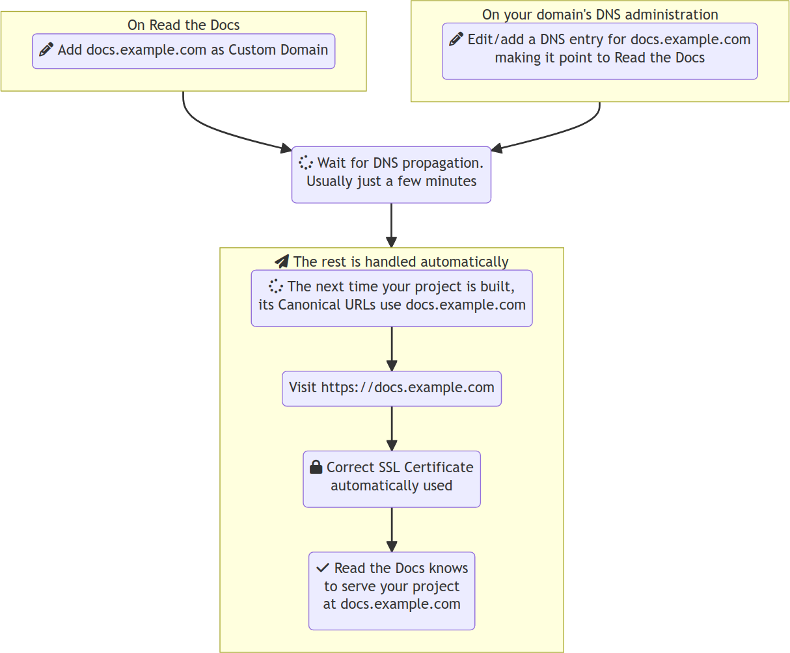

Custom domains
==============

You can serve your documentation project from your own domain,
for instance ``docs.example.com``.
This is great for maintaining a consistent brand for your product and its documentation.

.. _default-subdomain:

.. rubric:: Default subdomains

*By default*, your documentation is served from a Read the Docs *subdomain* using the project's :term:`slug`:

* ``<slug>.readthedocs.io`` for |org_brand|
* ``<slug>.readthedocs-hosted.com`` for |com_brand|.

.. seealso::

    :doc:`/guides/custom-domains`
        Information on creating and managing custom domains,
        and common configurations you might use to set up your domain

How custom domains work
-----------------------

To use a custom domain, two actions are needed from you:

#.  Enter the domain in your Read the Docs project's :guilabel:`Admin`
#.  Update your DNS provider with a new DNS entry. The name and value of the DNS entry is found in Read the Docs' :guilabel:`Admin`.

Once the new DNS record has propagated,
Read the Docs automatically issues an SSL certificate through Cloudflare and starts serving your documentation.

..
   We have generated an PNG version of the following diagram using mermaid.live
   Firstly, we generate an SVG, then we render it in a browser, then we take a screenshot,
   then we paste it into GIMP or similar and make the background transparent.

   If you wish to sketch diagrams locally, you can add sphinxcontrib-mermaid to
   this project's extensions and keep using the below code.

   SVG does not work because it embeds fontawesome from CDN (which is blocked by CSP)

   PLEASE KEEP THIS SOURCE CODE UPDATED
   .. mermaid::

       graph TD
           subgraph rtd [On Read the Docs]
             A(fa:fa-pencil Add docs.example.com as Custom Domain)
           end
           subgraph dns [On your domain's DNS administration]
             B(fa:fa-pencil Edit/add a DNS entry for docs.example.com making it point to Read the Docs)
           end

           rtd & dns-->C(fa:fa-spinner Wait for DNS propagation. Usually just a few minutes)

           direction LR
           subgraph automatic [fa:fa-paper-plane The rest is handled automatically]
             direction TB
             D(fa:fa-spinner The next time your project is built, its Canonical URLs use docs.example.com)
             D-->E(Visit https://docs.example.com)
             E-->F(fa:fa-lock Correct SSL Certificate  automatically used)
             F-->G(fa:fa-check Read the Docs knows  to serve your project  at docs.example.com)
           end

           C-->automatic

Your documentation can have multiple secondary domains but only one **canonical** domain name.
Additional domains or subdomains will redirect to the canonical domain.

To make this work, Read the Docs generates a special text that you are responsible for copy-pasting to your domain's DNS.
In most cases, the ``CNAME`` record is used.
This is all that's needed for a web browser to resolve your domain name to Read the Docs' servers and for our servers to match the right documentation project.
You can find step-by-step instructions for this in :doc:`/guides/custom-domains`.

Read the Docs uses a :doc:`/reference/cdn` to host and serve your documentation pages.
This final step isn't changed by a custom domain
and therefore the response times are unaffected as the delivery of resources happens through the same CDN setup.

Considerations for custom domain usage
--------------------------------------

Some open source projects have seen their domains expire.
Even prominent ones.
**It's important that you give the responsibility for managing your domain to someone reliable in your organization.**

The **canonical domain** feature allows you to have several domains and the canonical domain will be indexed by search engines.
The domain that you choose as your canonical domain is by far the most important one.
If you lose the canonical domain,
someone else can set up a website that search results will end up referring to.

.. seealso::

   In a URL, both the domain and the path (``https://<domain>/<path>``) are important.
   In combination, they are referred to as the *canonical URL* of a resource.

   Most documentation projects are versioned.
   Therefore, it's important to ensure that incoming links and search engine results point to the canonical URL of the resource
   and not a specific version that becomes outdated.

   To learn more about canonical URLs, see: :doc:`/canonical-urls`
