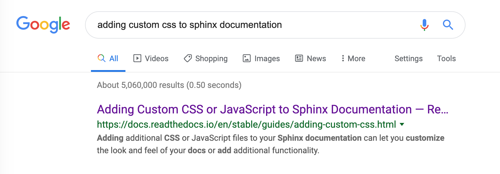

How to do search engine optimization (SEO) for documentation projects
=====================================================================

.. meta::
    :description lang=en:
        Looking to optimize your documentation project for search engines?
        This SEO guide will help your docs be better understood by both people and crawlers
        as well as help you rank higher in search engine results.

This article explains how documentation can be optimized to appear in search results,
ultimately increasing traffic to your docs.

While you optimize your docs to make them more friendly for search engine spiders/crawlers,
it's important to keep in mind that your ultimate goal is to make your docs
more :term:`discoverable <discoverability>` for your users.

By following :ref:`our best practices for SEO <guides/technical-docs-seo-guide:Best practices for documentation SEO>`,
you can ensure that when a user types a question into a search engine,
they can get the answers from your documentation in the search results.

.. seealso::

   This guide isn't meant to be your only resource on SEO,
   and there's a lot of SEO topics not covered here.
   For additional reading, please see the
   :ref:`external resources <guides/technical-docs-seo-guide:External resources>` section.

SEO basics
----------

Search engines like Google and Bing crawl through the internet
following links in an attempt to understand and build an index
of what various pages and sites are about.
This is called "crawling" or "indexing".
When a person sends a query to a search engine,
the search engine evaluates this index using a number of factors
and attempts to return the results most likely to answer that person's question.

How search engines "rank" sites based on a person's query
is part of their secret sauce.
While some search engines publish the basics of their algorithms
(see Google's published details on PageRank), few search engines
give all of the details in an attempt to prevent users from gaming the rankings
with low value content which happens to rank well.

Both `Google <https://support.google.com/webmasters/answer/35769>`_
and `Bing <https://www.bing.com/webmaster/help/webmaster-guidelines-30fba23a>`_ publish a set of guidelines
to help make sites easier to understand for search engines and rank better.
To summarize some of the most important aspects
as they apply to technical documentation, your site should:

* Use descriptive and accurate titles in the HTML ``<title>`` tag.
  For Sphinx, the ``<title>`` comes from the first heading on the page.
* Ensure your URLs are descriptive. They are displayed in search results.
  Sphinx uses the source filename without the file extension as the URL.
* Make sure the words your readers would search for to find your site
  are actually included on your pages.
* Avoid low content pages or pages with minimal original content.
* Avoid tactics that attempt to increase your search engine ranking
  without actually improving content.
* Google specifically `warns about automatically generated content`_
  although this applies primarily to keyword stuffing and low value content.
  High quality documentation generated from source code
  (eg. auto generated API documentation) seems OK.

  .. _warns about automatically generated content: https://support.google.com/webmasters/answer/2721306

While both Google and Bing discuss site performance as an important factor
in search result ranking, this guide is not going to discuss it in detail.
Most technical documentation that uses Sphinx or Read the Docs
generates static HTML and the performance is typically decent
relative to most of the internet.

Best practices for documentation SEO
------------------------------------

Once a crawler or spider finds your site, it will follow links and redirects
in an attempt to find any and all pages on your site.
While there are a few ways to guide the search engine in its crawl
for example by using a :ref:`sitemap <seo_sitemap.xml>`
or a :ref:`robots.txt file <seo_robots.txt>`
which we'll discuss shortly,
the most important thing is making sure the spider can follow links on your site
and get to all your pages.

Avoid unlinked pages ✅️
~~~~~~~~~~~~~~~~~~~~~~~~

When building your documentation,
you should ensure that pages aren't *unlinked*,
meaning that no other pages or navigation have a link to them.

Search engine crawlers will not discover pages that aren't linked from somewhere else on your site.

.. TODO: Create a "generic" tab?

.. tabs::

   .. tab:: Sphinx

        Sphinx calls pages that don't have links to them "orphans"
        and will throw a warning while building documentation that contains an orphan
        unless the warning is silenced with the :ref:`orphan directive <sphinx:metadata>`.

        We recommend failing your builds whenever Sphinx warns you,
        using the ``fail_on_warnings`` option in :ref:`.readthedocs.yaml <config-file/v2:sphinx>`.

        Here is an example of a warning of an unreferenced page::

            $ make html
            sphinx-build -b html -d _build/doctrees . _build/html
            Running Sphinx v1.8.5
            ...
            checking consistency... /path/to/file.rst: WARNING: document isn't included in any toctree
            done
            ...
            build finished with problems, 1 warning.

   .. tab:: MkDocs

      MkDocs automatically includes all ``.md`` files in the main navigation 💯️.
      This makes sure that all files are discoverable by default,
      however there are configurations that allow for unlinked files in various ways.
      If you want to scan your documentation for unreferenced files and images,
      a plugin like `mkdocs-unused-files`_ does the job.

.. _mkdocs-unused-files: https://github.com/wilhelmer/mkdocs-unused-files

Avoid uncrawlable content ✅️
~~~~~~~~~~~~~~~~~~~~~~~~~~~~~

While typically this isn't a problem with technical documentation,
try to avoid content that is "hidden" from search engines.
This includes content hidden in images or videos
which the crawler may not understand.
For example, if you do have a video in your docs,
make sure the rest of that page describes the content of the video.

When using images, make sure to set the image alt text or set a caption on figures.

.. TODO: Create a "generic" tab?

.. tabs::

   .. tab:: Sphinx

        For Sphinx, the image and figure directives support both alt texts and captions:

        .. code-block:: rst

            .. image:: your-image.png
                :alt: A description of this image

            .. figure:: your-image.png

                A caption for this figure

   .. tab:: MkDocs

        The Markdown syntax defines an alt text for images:

        .. code-block:: md

           { width="300" }

        Though HTML supports figures and captions,
        Markdown and MkDocs do not have a built-in feature.
        Instead,
        you can use markdown extensions such as `md-in-html`_ to allow the necessary HTML structures for including figures:

        .. code-block:: md

           <figure markdown>
              { width="300" }
              <figcaption>Image caption</figcaption>
           </figure>

.. _md-in-html: https://python-markdown.github.io/extensions/md_in_html/

.. _seo_redirects:

Redirects ✅️
~~~~~~~~~~~~~

Redirects tell search engines when content has moved.
For example, if this guide moved from ``guides/technical-docs-seo-guide.html`` to ``guides/sphinx-seo-guide.html``,
there will be a time period where search engines will still have the old URL in their index
and will still be showing it to users.
This is why it is important to update your own links within your docs as well as redirecting.
If the hostname moved from docs.readthedocs.io to docs.readthedocs.org, this would be even more important!

Read the Docs supports a few different kinds of :doc:`user defined redirects </user-defined-redirects>`
that should cover all the different cases such as redirecting a certain page for all project versions,
or redirecting one version to another.

.. seealso:

   :doc:`/guides/best-practice/links`
      Following best practices to avoid broken links is great for search engine ranking.

Canonical URLs ✅️
~~~~~~~~~~~~~~~~~~

Anytime very similar content is hosted at multiple URLs,
it is pretty important to set a canonical URL.
The canonical URL tells search engines where the original version
your documentation is even if you have multiple versions on the internet
(for example, incomplete translations or deprecated versions).

Read the Docs supports :doc:`setting the canonical URL </canonical-urls>`
if you are using a :doc:`custom domain </custom-domains>`
under :guilabel:`Admin` > :guilabel:`Domains`
in the Read the Docs dashboard.

.. _seo_robots.txt:

Use a robots.txt file ✅️
~~~~~~~~~~~~~~~~~~~~~~~~~

A ``robots.txt`` file is readable by crawlers
and lives at the root of your site (eg. https://docs.readthedocs.io/robots.txt).
It tells search engines which pages to crawl or not to crawl
and can allow you to control how a search engine crawls your site.
For example, you may want to request that search engines
:ref:`ignore unsupported versions of your documentation <faq:How can I avoid search results having a deprecated version of my docs?>`
while keeping those docs online in case people need them.

By default, Read the Docs serves a ``robots.txt`` for you.
To customize this file, you can create a ``robots.txt`` file
that is written to your documentation root on your default branch/version.

See the `Google's documentation on robots.txt <https://support.google.com/webmasters/answer/6062608>`_
for additional details.

.. _seo_sitemap.xml:

Use a sitemap.xml file ✅️
~~~~~~~~~~~~~~~~~~~~~~~~~~

A sitemap is a file readable by crawlers that contains a list of pages
and other files on your site and some metadata or relationships about them
(eg. https://docs.readthedocs.io/sitemap.xml).
A good sitemaps provides information like how frequently a page or file is updated
or any alternate language versions of a page.

Read the Docs generates a sitemap for you that contains the last time
your documentation was updated as well as links to active versions, subprojects, and translations your project has.
We have a small separate guide on :doc:`sitemaps </reference/sitemaps>`.

See the `Google docs on building a sitemap <https://support.google.com/webmasters/answer/183668>`_.

Use meta tags ✅️
~~~~~~~~~~~~~~~~~

Using a meta description allows you to customize how your pages
look in search engine result pages.

Typically search engines will use the first few sentences of a page if no meta description is provided.
In Sphinx, you can customize your meta description using the following RestructuredText:

.. sourcecode:: rst

    .. meta::
        :description lang=en:
            Adding additional CSS or JavaScript files to your Sphinx documentation
            can let you customize the look and feel of your docs or add additional functionality.

    Google search engine results showing a customized meta description

Moz.com, an authority on search engine optimization,
makes the following suggestions for meta descriptions:

* Your meta description should have the most relevant content of the page.
  A searcher should know whether they've found the right page from the description.
* The meta description should be between 150-300 characters
  and it may be truncated down to around 150 characters in some situations.
* Meta descriptions are used for display but not for ranking.

Search engines don't always use your customized meta description
if they think a snippet from the page is a better description.

Measure, iterate, & improve
---------------------------

Search engines (and soon, Read the Docs itself) can provide useful data
that you can use to improve your docs' ranking on search engines.

Search engine feedback
~~~~~~~~~~~~~~~~~~~~~~

`Google Search Console <https://search.google.com/search-console>`_ and
`Bing Webmaster Tools <https://www.bing.com/webmaster/help/webmaster-guidelines-30fba23a>`_
are tools for webmasters
to get feedback about the crawling of their sites (or docs in our case).
Some of the most valuable feedback these provide include:

* Google and Bing will show pages that were previously indexed that now give a 404
  (or more rarely a 500 or other status code).
  These will remain in the index for some time but will eventually be removed.
  This is a good opportunity to create a :ref:`redirect <seo_redirects>`.
* These tools will show any crawl issues with your documentation.
* Search Console and Webmaster Tools will highlight security issues found
  or if Google or Bing took action against your site because they believe it is spammy.

Analytics tools
~~~~~~~~~~~~~~~

A tool like Google Analytics,
along with our :doc:`integrated Read the Docs analytics </traffic-analytics>`,
can give you feedback about the search terms people use to find your docs,
your most popular pages, and lots of other useful data.

Search term feedback can be used to help you optimize content for certain keywords or for related keywords.
For Sphinx documentation, or other technical documentation that has its own search features,
analytics tools can also tell you the terms people search for within your site.

Knowing your popular pages can help you prioritize where to spend your SEO efforts.
Optimizing your already popular pages can have a significant impact.

External resources
------------------

Here are a few additional resources to help you learn more about SEO
and rank better with search engines.

* `Moz's beginners guide to SEO <https://moz.com/beginners-guide-to-seo>`_
* `Google's Webmaster Guidelines <https://support.google.com/webmasters/answer/35769>`_
* `Bing's Webmaster Guidelines <https://www.bing.com/webmaster/help/webmaster-guidelines-30fba23a>`_
* `Google's SEO Starter Guide <https://support.google.com/webmasters/answer/7451184>`_
